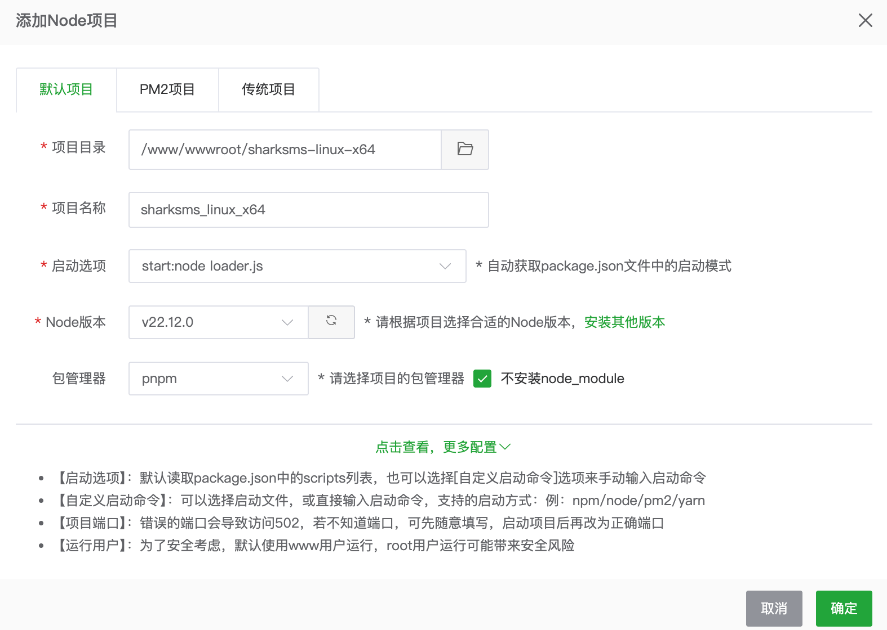
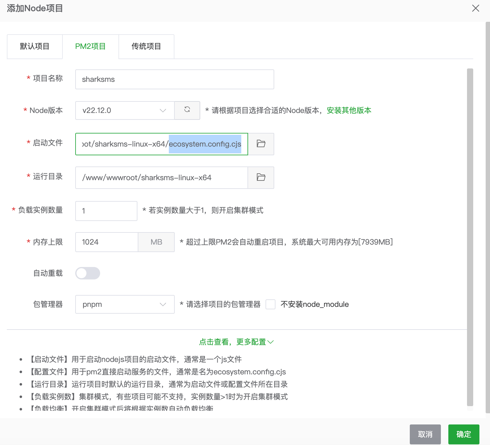
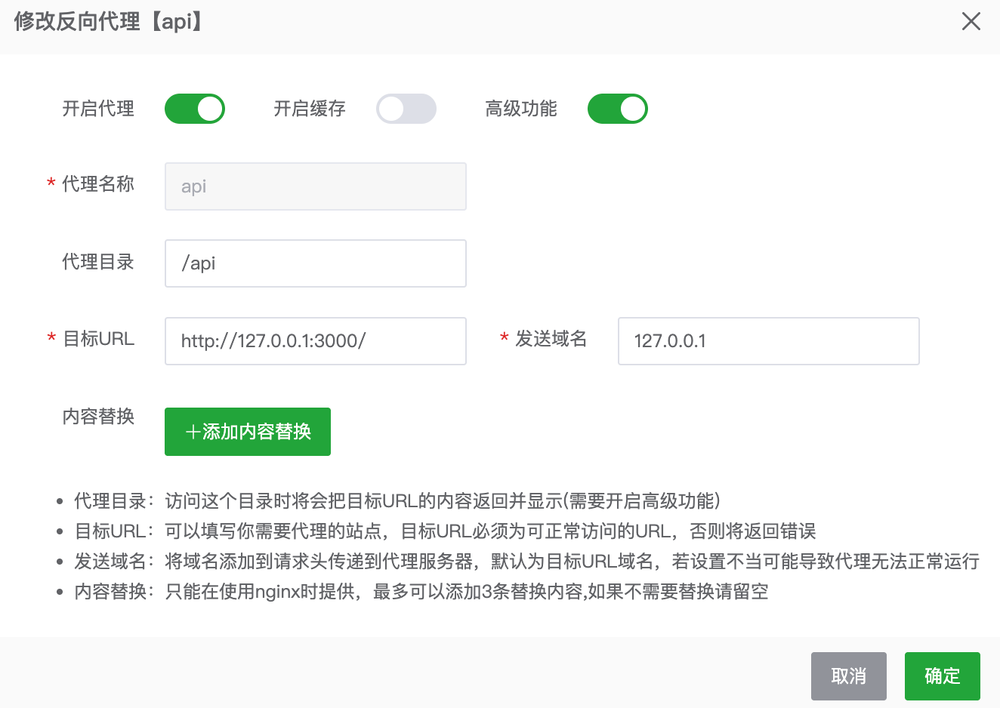

# sharkSMS 前后端部署教程

## 后端部署说明 (建议 ubuntu 24.04)

1. **安装宝塔面板**  
   参考宝塔官方安装命令进行安装。

2. **安装运行依赖环境**  
   在宝塔面板的软件商店中安装以下组件：  
   - MySQL 8.0+  
   - Redis 8.0+  
   - Node.js 版本管理器
   - PHP 7.4

3. **安装 Node 环境**  
   - 在宝塔面板中，依次进入「软件商店」→「已安装」，找到「Node.js 版本管理器」并点击「设置」
   - 点击「更新版本列表」，在列表中找到 **v22.12.0** 并点击安装
   - 等待安装完成后，将该版本设置为「命令行版本」即可

4. **拉取 sharkSMS 源文件并解压**  
   - 打开宝塔面板的「文件」，切换到 **/www/wwwroot/** 目录，点击「终端」
   - 执行以下命令拉取 sharkSMS 源文件：  
     ```bash
     git clone https://github.com/SharkMesh/sharksms.git
     ```
   - 执行以下命令确认服务器架构版本：
     ```bash
     uname -m
     ```
   - **选择对应的版本目录：**
     - 如果输出为 `x86_64`，请执行 `cd /www/wwwroot/sharksms/sharksms-linux-x64`
     - 如果输出为 `aarch64` 或 `arm64`，请执行 `cd /www/wwwroot/sharksms/sharksms-linux-arm64`

5. **修改配置文件并部署后端**  
   - 在终端中执行以下命令生成配置文件 `.env` ：
     ```bash
     cp .env.example .env
     ```
   - 关闭终端，打开.env文件，并修改配置，完成后保存
   - 在宝塔面板中找到 「网站」，切换分类后 「Node项目」，点击「添加项目」
   - 两种部署方式 `单进程` 和 `PM2多进程` 任选一种即可 (推荐 `PM2多进程`)

   **单进程**
     
   **PM2多进程**  
   
   - 务必使用root用户部署，否则会报错
   - 选择任意一种部署方式，配置好，点击确认即可
   - 切记放行端口 `3000` 即可访问后端接口
   - 至此，sharkSMS 后端部署完成

## 前端部署说明

1. **添加网站**  
   - 在宝塔面板中，依次点击「网站」→「PHP项目」→「添加站点」
   - 填写域名
   - 选择根目录，刚才拉取的项目目录中的 `frontend` 目录作为根目录，点击确认
   - 打开网站设置 「网站」→「PHP项目」，找到刚才添加的网站，点击「设置」
   - 点击「反向代理」→ 「添加反向代理」按照下图配置参数进行配置，并保存

   **反向代理配置**
   

   - 至此，sharkSMS 前端部署完成

## 常见问题说明

**如何找到机器码**
- 运行一次后端服务，即可在日志中找到机器码 `ID: xxxxxxx`

**agent端连接问题**
- 如agent端连接失败，则需要检查后端服务器的mysql服务 `3306` 端口是否放行，后端数据库是否开启 agent端IP 访问权限

**后端无法启动问题**
- 请确认当前服务器是否经过授权，若未授权，则需要先授权后端服务，授权后即可启动后端服务

## agent端常用命令

- **查看服务状态**：`systemctl status sms_agent`
- **停止开机自启**：`sudo systemctl disable sms_agent`
- **开启开机自启**：`sudo systemctl enable sms_agent`
- **查看程序版本**：`/opt/sms_agent/sms_agent -v`
- **查看节点日志**：`journalctl -u sms_agent -f`
- **查看开机启动状态**：`systemctl is-enabled sms_agent`
- **agent端配置文件位置**: `/opt/sms_agent/.env`

### 一键更新 (仅更新二进制文件)
```bash
curl -sSL https://raw.githubusercontent.com/SharkMesh/sharksms/master/install.sh | sudo bash -s -- --update
```

### 一键卸载 Agent
```bash
curl -sSL https://raw.githubusercontent.com/SharkMesh/sharksms/master/install.sh | sudo bash -s -- --uninstall
```

## agent端参数说明
| 参数 | 说明 | 示例 |
| :--- | :--- | :--- |
| `--db-user` | MySQL 用户名 | `root` |
| `--db-pass` | MySQL 密码 | `password` |
| `--db-name` | 数据库名 | `sms_db` |
| `--mem-limit` | 内存硬限制 (G) | `1G` |
| `--cpu-limit` | CPU 使用率限制 | `50%` |
| `--agent-id` | Agent 唯一标识 | `node01` |
| `--skip-redis` | 不自动安装 Redis | - |
| `--update` | 仅更新二进制文件 | - |

## 项目更新说明

**更新项目**
- 切换到项目目录 `/www/wwwroot/sharksms/`， 依次执行 `git reset --hard` 和 `git pull` 即可更新项目，如果后端 `.env.example` 修改了，则需同步修改.env文件

**更新疑难解答**
- 如您修改了前端代码，请先备份，然后执行 `git reset --hard` 以解决冲突进行更新

## 更新补丁 v1.0.3升级v1.0.5

```sql
-- 为卡密表增加字段
ALTER TABLE `ms_vouchers` 
ADD COLUMN `display_duration` int DEFAULT 600 COMMENT '最大分钟数' 
AFTER `concurrent_tasks`;

-- 为用户表增加字段
ALTER TABLE `ms_users` 
ADD COLUMN `display_duration` int DEFAULT 0 COMMENT '最大分钟数' 
AFTER `max_concurrent_tasks`;

-- 为套餐表增加字段
ALTER TABLE `ms_packages` 
ADD COLUMN `display_duration` int NOT NULL DEFAULT 600 COMMENT '最大分钟数' 
AFTER `concurrent_tasks`;
```